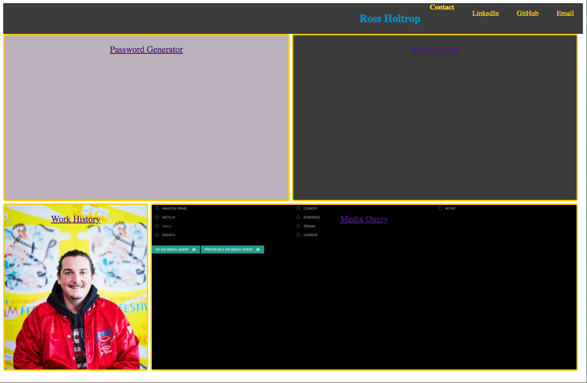

# Portfolio

* This repository contains HTML and CSS at this time and was created as my week 2 homework assignment for bootcamp. It has most recently been updated for week 8. 

Quick snapshot of the site

Deployed version: https://raws-boop.github.io/Portfolio/

Additional links
1. [Updated Portfolio](https://github.com/raws-boop/Portfolio)
2. [GitHub Profile](https://github.com/raws-boop)
3. [Updated Resume](https://docs.google.com/document/d/1718PusYpHD3oOypqst69B8Kc_JwECe_t_5zPrQ64dVA/edit?usp=sharing)
4. [Updated LinkedIn](https://www.linkedin.com/in/ross-holtrop/)

contact the developer: holtrop.ross@gmail.com